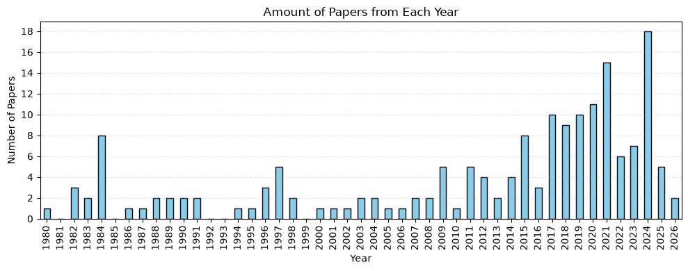
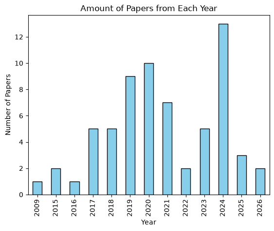
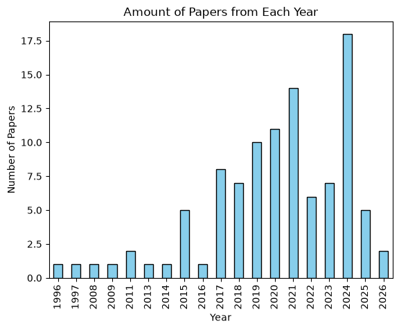

# Research Log: Eplanatory Gap Project

## Current Methodology

I will use two forms of data extraction. The first method will be based on phenomenas that present the explanatory gap. I will search for certain key words and tags to find phenomenas. I do not at all want to choose manually between more subjective or objective essays. I just want to see what conversations are being had on the subject. This first method of extraction will be split in half: I will query for major phenomenas and minor phenomenas. The second method will be based on citations.

## [7/17/2026]

I woke up and the program was finished running. It said that 10909 abstracts were recovered after 4 hours.

After running a separate filtering part, it kept 72 papers. Now, the total amount of filtered papers, after I extended the list, was 174.

The way I added the rescued papers, as dictionaries with attributes, vs. the normal filtered papers showed a different. The list now contained dicts and lists. Therefore, the way I would have to get data would require some trys and excepts in order to access the data in two different ways without crashing.

I ran the safely modified, simple subjective search and got back these:
- Explantory Gap: 0 -> 0
- Subjective: 21 -> 28
- Phenomenology: 12 -> 23
- Conscious: 6 -> 8

I created a graph to showcase the yearly tracking of the 174 papers. I successfully mapped out a complete progress from the 80s to the 2020s. In the extraction right before this, I had only two papers from 96/97. Now, I have 20 papers from the 1980s alone. This is a major success and can be seen here:

However, I realized that in the four hours I let the program request abstracts from PubMed, I forgot to ask for the authors as well. So, I went to the section where I collected all the essential information before putting it in a dataframe. There, I added a couple fallbacks to search the massive list of papers missing abstracts for a list of authors based on the title.

After this, I was still perplexed as to why so many papers were getting dropped. So, I decided to go back to my filtering terms just to experiment. I add "cogniti" and "explanatory gap" to the topic_terms list. For the first application of filtering (on the papers which had abstracts from Semantic Scholar) it kept 306 papers instead of the 100 previously. When I applied these new filters for the second half (the papers which had abstracts from Semantic Scholar) it kept 303 papers, a massive increase from the 60 previously. Interestingly, none of these new papers included the phrase "explanatory gap". Instead, the massive increase came from "congiti".
- cogniti: 466
- explanatory gap: 0

I decided to remove the phrase "cogniti" as I felt it was far too broad and was polluting my highly precise neuroscience papers on musical frisson with more general music papers. The immediate jump was far too noticeable and risky.

6th Commit

## [7/16/2026]

I started with building the first method. I would specifically look into a major phenomena of the explanatory gap: musical frisson.

I created a list of terms and a list of search queries. I used a loop which had AsyncSemanticSearch search for each query, and then give back the 1000 results. But there would be a high amount of duplicates as the bucket filled up with results from these similar queries. So, I made the program only add to the bucket unique papaers. I was happy to receive consistently 5000-6000 unique papers which I would then filter. After I would apply filtering, I was hoping for a few hundred papers to be kept.

Initially I was just using one list of terms for filtering. This was yielding me around 180 results. However, I switched to two lists of terms, topic-related and neuroscience related, to be more precise. This first application of the dual-filter cut down the results to only 33 papers. After refining both lists with numerous more terms, I managed to keep 74 papers. This shows there was likely a lot of neuroscientific terms I was missing out on at first. After adding more terms and revising some of the queries, I got to keep 72 papers. One more expansion of terms left me with 82 papers. 

I decided to make two frequency dictionaries to find out which terms were being found the most from the dual terms lists. So, I would collect found terms in a list. At first, I made the program add each term found before papers were erased. But this was leaving phantom data in my frequency dictionaries. So, I made it add each term found in a paper to a temp list, and then only added those temp terms if the papers were kept. Then, I collected the found terms lists into dictionaries and printed the results.

After all this, I had my accurate frequencies. But I found certain words to be far too broad when the point of the Neuro Terms list was to identify the specific neuroscience genre. Interdisciplinary words like "brain" would likely already be covered if someone was talking about an fMRI scan. These common words were:
- physiologic: 36
- reward: 33
- brain: 30
- scan: 4

I dropped physiologic and merged brain / scan. Then, I changed reward to reward circuit, reward system and reward path. After doing so, I was left with 65 papers. That means that I eliminated 17 papers that might have been talking about the psychological effects of brain frills, not the pure neuroscience. Here's some noticeable results:
- reward system: 5
- reward circuit: 3
- brain scan: 0

4th Commit

I started by doing a very simple search to see if a couple subjective words are being used in these gathered papers. This is a preview of what should be done later and more extensively when examining subjective focus. I got back:
- Explantory Gap: 0
- Subjective: 18
- Phenomenology: 10
- Conscious: 5

Then, I cleaned up the data from the filtered list of papers and put it into a dataframe. After doing so, I decided to visualize this data based on which articles come from which year. After all, my project depends upon proper historicity. To my dismay, I saw that the 65 papers were mostly incredibly recent. Here was the graph I saw:

Because of this, I decided to revisit my Semantic Scholar scraping. I implemented a list of year periods so that I can gather back specific papers per specific era. This significantly increased the amount of time to scrape from around 2 minutes to around 30 minutes. Throughout these 30 minutes, Semantic Scholar was prone to crash. (This unfortunately happened to me once right as the scraping reached the very end of the 2020-2026 era). Therefore, I incorporated a try and except catch. Furthermore, I put in a while loop so that if a crash occurs, the program doesn't just skip to the next era. For this first attempt, it took around 50 minutes to complete and gathered 39,133 unique papers in the end.

Unfortunately, after this first attempt, the filtering process found that 30,000 of these papers didn't have abstracts. This was a serious blunder. Out of the 9000 papers that were searched for both on topic and neuroscience terms, only 102 total papers met the criteria. Here was the resulting graph and the subjective terms preview:

- Explantory Gap: 0
- Subjective: 21
- Phenomenology: 12
- Conscious: 6

This is certainly a major improvement. I have successfully achieved around 40 new papers and have broken into the 90s where most of this medical technology for studying musical frisson was first created. Therefore, it is no shock to see these results.

That being said, I don't want to so quickly abandon those 30,000 papers which got dropped for missing abstracts. Therefore, I will look to incorporate a search to PubMed for the abstracts. This will be effective in two ways. Not only will I find the missing pieces, but I will effectively be filtering for medical and neurosciene related papers only. That way, I will avoid pulling purely historical, musical, psychological or philosophical papers.

I added *.csv to gitignore

5th Commit

Installed pymed

imported time to use time.sleep for this pymed exploration instead of asyncio

With the function I built, searching 30000 papers using PubMed without an API key would take at least 4 hours minimum. Therefore, I'll apply for an API key in the meantime while I let it run.

Got my API key from pubmed instantly

Put key in env and got email input

Created function for querying pubmed for the paper's abstract

Created for loop to go through each paper in the list missing an abstract and if the abstract was recovered, take its attributes into a clean dict p and append it to the rescued list (resc_list).

Let this loop run for 124 minutes and 3000 papers were recovered but then it froze.

I had to write another script segment which would start where the previous one left off and keep collecting data until it finished.

I started this segmenet and went to sleep.

## [7/15/2026]

Woke up and found I was still IP blocked

Applied for and got API key in less than 10 minutes

2nd Commit

Downloaded dotenv in venv

Created an .env to safely hold my key

Ensure .env was hidden from git

I made the program check if the user’s env has a valid API key.
- If so, continues
- If not, it defaults to checking if the IP is good via a simple request
- If the IP is good, continues

I had to make override=True for load_dotenv in order for the proper API to be accessed everytime.

Then I made a test for validating the key

I put in my actual key into .env and started trying the program.

I made it access specific fields and then switched to getattr because some papers didnt have abstracts. I put a cap on the characters for the abstract.

I had to switch to using AsyncSemanticScholar because of stalling in the background. 

I added await to statements to the two places where I search in Semantic Search (places #3 and #4)

Switched around order of if conditions for step 1 to prevent crash (put api_key is None first)

3rd Commit

## [7/14/2026]

0th Commit (Initial Commit)

Downloaded pandas, requests, semanticscholar, and ipykernel into my virtual environment.

Had to manually add my venv to be rezognized for usage in VScode

Wrote code and encountered error/status code 429 using requests

Stopped using requests and switched to semantic scholar. Accidentally tried printing 17000 papers in a loop.

Ran loop again and found I was IP blocked for too many requests.

Added a checker to see when my IP was blocked or not. Got deadlocked in backlogging process between python and Semantic Scholar.

Installed and implemented nest_asyncio to process deadlock. Found I was still blocked.

1st Commit?
